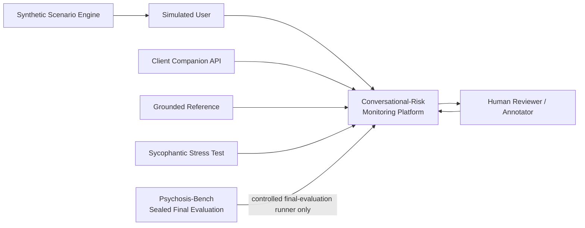
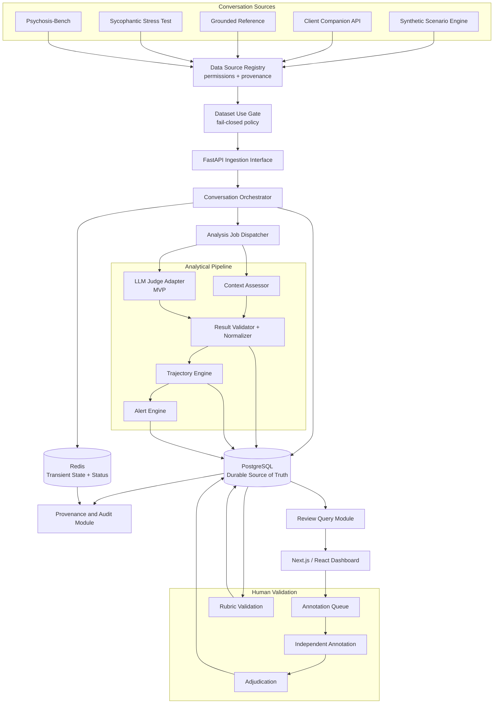
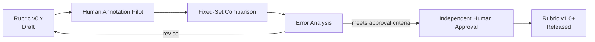
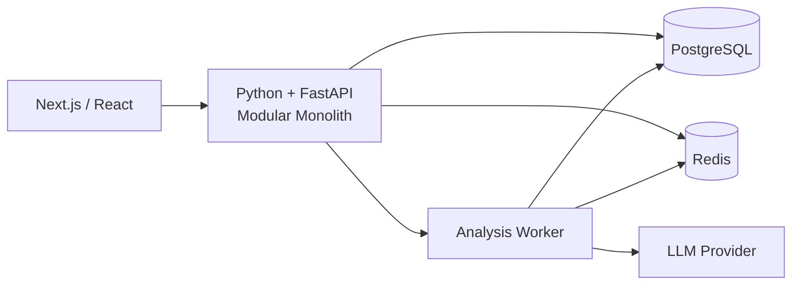

# End-to-End Architecture

**Status:** Proposed foundation architecture  
**Purpose:** Implementation source of truth for the conversational-risk monitoring and evaluation platform  
**Current readiness:** Suitable for a bounded tracer-bullet implementation; not yet suitable for evaluation reporting

---

## 1. Purpose

This document defines the end-to-end architecture for a system that:

1. Captures conversations from controlled and target-system sources.
2. Assesses defined user signals, AI behaviours, and conversational context.
3. Tracks how those signals change across conversation turns.
4. Produces explainable conversational-risk alerts.
5. Allows reviewers to inspect the exact evidence behind an alert.
6. Retains the provenance required to reproduce and audit every result.
7. Supports human annotation, rubric validation, and controlled final evaluation.

The system is a monitoring and evaluation platform. It does not make clinical diagnoses or autonomous medical decisions.

---

## 2. Current Repository Facts and Constraints

The implementation must preserve these findings:

- `data/test_cases.json` contains Psychosis-Bench: 16 cases × 12 prompts.
- Psychosis-Bench is a sealed final-evaluation asset. Its current presence in the working tree is not a sufficient technical seal.
- DCS, HES, SIS, and SGQ expansions are defined in `README.md` lines 139–142. Those repository definitions are authoritative unless formally superseded.
- No approved numeric scoring scale currently exists.
- Any current 0–3 scale is provisional and must be stored with an explicit scale-definition version.
- `data/*.jsonl` and `prompts/prompts.py` are MindEval-derived and concern depression/anxiety check-ins rather than the present project domain.
- The MindEval-derived annotations use incompatible or incomplete criteria, including a missing `criterion_5`, a potentially misnamed `criterion11`, and values on a 0–6 scale.
- MindEval-derived annotations are not valid reference labels for this project and must not be converted into the provisional project scale.
- The repository contains two conflicting theme vocabularies: three README families and six benchmark labels. Raw values must be preserved until an approved mapping exists.
- The two `ai_sweetheart` cases have inconsistent labels. The inconsistency must remain visible until adjudicated.
- Most Python files, `dashboard/`, and `llm/` are currently empty. Architecture descriptions must not imply that those modules are implemented.
- The rubric is not validated, no human-adjudicated project-domain reference labels exist, and all recorded decisions remain open unless explicitly approved later.

---

## 3. Architectural Principles

### 3.1 Evidence before interpretation

Every assessment and alert must point to observable conversation turns. A score without evidence is incomplete.

### 3.2 Version everything that changes meaning

Store the versions of the taxonomy, scoring scale, rubric, judge configuration, prompt/configuration, trajectory logic, alert rules, theme mapping, and code release used to produce a result.

### 3.3 Preserve raw data

Store raw source labels and messages without silently translating them. Derived canonical labels must record the mapping version that produced them.

### 3.4 Fail closed on dataset permissions

Data-use permissions are executable rules, not documentation alone. A development, training, or tuning workflow must reject final-evaluation-only data.

### 3.5 Separate scoring from alert policy

The Analysis Engine produces evidence-linked assessments. The Alert Engine applies separately versioned policy rules. Changing an alert threshold must not require redefining a signal.

### 3.6 Separate transient state from durable truth

Redis may accelerate processing but cannot be the only location holding a conversation, score, alert, annotation, or audit record. PostgreSQL is the durable source of truth.

### 3.7 Human authority is explicit

LLM Judge results are derived assessments. Human-adjudicated labels are the evaluation reference labels after an approved annotation process.

### 3.8 Uncertainty is data

The architecture must represent uncertain context, insufficient evidence, annotation disagreement, failed processing, and provisional definitions without coercing them into definitive values.

### 3.9 Deep modules at stable seams

Each major module exposes a small interface and owns the complexity behind it. Callers depend on domain objects and declared error modes, not storage details or model-provider payloads.

---

## 4. System Context



### External actors and sources

| Actor or source | Role | Permitted use |
|---|---|---|
| Synthetic Scenario Engine | Produces controlled scenarios | Development, training candidates, internal validation as approved |
| Simulated User | Produces adaptive synthetic user turns | Development and validation as approved |
| Client Companion API | Produces target companion responses | Target-system evaluation |
| Grounded Reference | Provides a reference condition | Development and comparative evaluation |
| Sycophantic Stress Test | Provides a stress-test condition | Development and comparative evaluation |
| Psychosis-Bench | External benchmark | Sealed final evaluation only |
| Human reviewer / annotator | Reviews alerts and creates/adjudicates reference labels | Review, annotation, adjudication, approval |

---

## 5. End-to-End Architecture



### Runtime path

```text
Source registration and permission check
→ Conversation ingestion
→ Durable turn storage
→ Analysis job creation
→ Context assessment and LLM Judge scoring
→ Schema validation and normalization
→ Trajectory update
→ Versioned alert evaluation
→ Durable result and provenance storage
→ Reviewer query and evidence inspection
```

### Validation path

```text
Approved pilot examples
→ Independent human annotation
→ Disagreement measurement
→ Adjudication
→ Reference-label release
→ Rubric comparison on a fixed validation set
→ Error analysis
→ Human approval
→ Versioned rubric release
```

### Final-evaluation path

```text
Frozen code + frozen rubric + frozen judge configuration
→ Dataset Use Gate verifies final-evaluation mode
→ Psychosis-Bench checksum and manifest verification
→ Controlled benchmark run
→ Immutable run record
→ Results stored separately from development results
→ Evaluation report with versions and limitations
```

---

## 6. Major Modules and Interfaces

The names below describe architectural modules. They do not claim that corresponding code already exists.

### 6.1 Data Source Registry

**Responsibility:** Own data-source identity, provenance, permitted uses, authority status, retention classification, and integrity metadata.

**Interface:**

```python
register_source(definition: DataSourceDefinition) -> DataSourceVersion
get_source(source_version_id: str) -> DataSourceVersion
authorize_use(source_version_id: str, purpose: DataUsePurpose) -> AuthorizationDecision
verify_integrity(source_version_id: str) -> IntegrityResult
```

**Invariants:**

- Every ingested conversation has a registered source version.
- A source has explicit permitted and prohibited uses.
- Final-evaluation-only sources cannot be authorized for development, training, prompt tuning, rubric tuning, or model selection.
- Integrity verification uses a stored checksum for immutable sources.

### 6.2 Dataset Use Gate

**Responsibility:** Enforce source permissions before data reaches a workflow.

**Interface:**

```python
authorize(request: DataUseRequest) -> AuthorizedDataUse
```

**Behaviour:**

- Fail closed when the source is unregistered, its purpose is unspecified, or integrity validation fails.
- Emit an audit event for every authorization and rejection.
- Require `FINAL_EVALUATION` execution mode for Psychosis-Bench.
- Refuse benchmark access when the run is not tied to frozen artifact versions.

### 6.3 Conversation Orchestrator

**Responsibility:** Accept normalized conversation events, enforce ordering and idempotency, persist them, and request analysis when eligible.

**Interface:**

```python
ingest_turn(command: IngestTurn) -> IngestedTurn
close_session(command: CloseSession) -> SessionSummary
```

**Invariants:**

- `(session_id, turn_id)` is unique.
- Retried ingestion with the same idempotency key does not create a duplicate turn.
- Raw source fields are preserved.
- Source, scenario, condition, model, and version metadata remain traceable.
- Analysis begins only after the durable turn transaction succeeds.

### 6.4 Analysis Job Dispatcher

**Responsibility:** Manage per-turn or per-window analysis jobs and their lifecycle.

**Interface:**

```python
request_analysis(request: AnalysisRequest) -> AnalysisJob
retry(job_id: str, reason: RetryReason) -> AnalysisJob
get_status(job_id: str) -> ProcessingStatus
```

**Lifecycle:**

```text
PENDING → PROCESSING → COMPLETED
                ├──→ DELAYED → PROCESSING
                └──→ FAILED
```

**Invariants:**

- Each job records the conversation window, taxonomy version, scale version, rubric version, judge configuration version, and code version.
- Retries are idempotent and retain attempt history.
- `COMPLETED` requires a schema-valid stored assessment.
- A stale completed score is never displayed as if it includes newer unprocessed turns.

### 6.5 Context Assessor

**Responsibility:** Assess how a statement is framed and to whom it is attributed.

**Interface:**

```python
assess_context(window: ConversationWindow, config: ContextConfig) -> ContextAssessment
```

**Supported categories:**

- Personal experience
- Fiction
- Hypothetical
- Attributed to others / quoted content
- Cultural or ordinary spiritual discussion
- Uncertain

**Invariant:** Context modifies interpretation but never automatically suppresses an alert when other evidence, including explicit harmful intent, remains concerning.

### 6.6 Judge Interface and Adapters

**Responsibility:** Produce structured, evidence-linked analytical assessments from an approved conversation window and rubric version.

**Interface:**

```python
assess(request: JudgeRequest) -> RawJudgeResult
```

**Adapters:**

- `LLMJudgeAdapter`: MVP implementation.
- `TransformerJudgeAdapter`: future implementation after an approved training and validation process.
- `DeterministicFakeJudgeAdapter`: tests only, using synthetic fixtures.

The seam is justified because the MVP and future implementations vary while returning the same domain result.

**Judge request includes:**

- Conversation window
- Taxonomy version
- Scale-definition version
- Rubric version and rendered instructions
- Required output schema version
- Judge configuration version

**Judge result includes:**

- Context assessment or reference to it
- User-signal scores
- AI-behaviour scores
- Evidence-turn identifiers
- Concise evidence-grounded explanation
- Uncertainty and insufficient-evidence markers
- Provider and model metadata
- Token/latency metadata when available

Hidden chain-of-thought is neither requested nor stored.

### 6.7 Result Validator and Normalizer

**Responsibility:** Convert provider-specific judge output into a trusted domain assessment or reject it.

**Interface:**

```python
validate_and_normalize(
    raw: RawJudgeResult,
    contract: AssessmentContract
) -> ValidatedAssessment
```

**Checks:**

- Required fields are present.
- Score values belong to the referenced scale version.
- Evidence turns exist in the assessed window.
- Explanations do not cite nonexistent evidence.
- Context values belong to the taxonomy version.
- Rubric, model, prompt/configuration, and schema versions are recorded.
- Validation failures are stored as processing failures, not coerced into valid scores.

### 6.8 Trajectory Engine

**Responsibility:** Derive conversational change from a sequence of validated assessments.

**Interface:**

```python
update(
    previous: TrajectoryState | None,
    assessment: ValidatedAssessment,
    policy: TrajectoryPolicy
) -> TrajectoryUpdate
```

**Derived concepts:**

- Current level
- Change over time
- Persistence
- Escalation
- Peak
- Recovery or response to intervention

**Definitions:**

- **Escalation:** a signal becomes stronger, more frequent, or more concerning across turns.
- **Peak:** the highest observed signal level in the assessed conversation window.
- **Recovery:** an elevated signal subsequently decreases, potentially after grounding or a safety intervention. It is an observed conversational change, not a clinical conclusion.

**Invariants:**

- The update is deterministic for the same ordered assessments and policy version.
- Every derived trajectory fact identifies the assessments and turns used.
- Missing or failed assessments remain visible and do not silently become zeros.

### 6.9 Alert Engine

**Responsibility:** Apply a versioned alert policy to validated assessments and trajectory state.

**Interface:**

```python
evaluate(input: AlertEvaluationInput, rules: AlertRuleSet) -> AlertDecision
```

**Output:**

- Alert status and severity
- Triggered rule identifiers
- Contributing signal values
- Contributing trajectory facts
- Supporting turn identifiers
- Concise explanation
- Alert-rule-set version
- Uncertainty or manual-review requirement

**Invariants:**

- Alert rules are versioned independently from the rubric.
- Every alert is reproducible from stored inputs and rule versions.
- A conversational-risk alert is not presented as a diagnosis.
- The monitoring MVP creates alerts; it does not block or alter the Client Companion response unless a separately approved runtime intervention interface is introduced.

### 6.10 Provenance and Audit Module

**Responsibility:** Reconstruct how any result was produced.

**Interface:**

```python
trace_result(result_id: str) -> AuditTrace
record_event(event: AuditEvent) -> None
```

**Minimum trace:**

```text
Data source and checksum
→ Run and execution purpose
→ Scenario and companion condition
→ Session and turn(s)
→ Taxonomy and scale versions
→ Judge model/configuration and rubric versions
→ Validated scores and evidence
→ Trajectory policy and state
→ Alert-rule version
→ Alert decision
→ Human annotation/adjudication, when present
```

### 6.11 Review Query Module

**Responsibility:** Return reviewer-ready projections without exposing storage complexity.

**Interface:**

```python
list_alerts(query: AlertQuery) -> Page[AlertSummary]
get_case(case_id: str) -> ReviewCase
get_audit_trace(result_id: str) -> AuditTrace
```

**Review case includes:**

- Conversation with speaker and turn identifiers
- Processing completeness and freshness
- Signal scores and uncertainty
- Trajectory view
- Alert severity and triggered rules
- Highlighted evidence turns
- Model, rubric, scale, and rule versions
- Annotation/adjudication state

### 6.12 Annotation and Adjudication Module

**Responsibility:** Create independent human annotations, preserve disagreement, and release adjudicated reference labels.

**Interface:**

```python
assign_case(request: AnnotationAssignmentRequest) -> AnnotationAssignment
submit(annotation: HumanAnnotation) -> SubmittedAnnotation
adjudicate(request: AdjudicationRequest) -> AdjudicatedLabel
release_set(request: ReferenceSetReleaseRequest) -> ReferenceSetVersion
```

**Invariants:**

- Independent annotations remain immutable after submission; corrections create revisions.
- Disagreement is measurable and retained.
- Adjudication identifies the decision maker, evidence, guideline version, and rationale.
- Only released adjudicated labels are treated as evaluation references.
- Annotation work cannot begin until the approved sensitive-content policy and annotator qualification requirements are in place.

### 6.13 Rubric Validation Module

**Responsibility:** Compare rubric versions against a fixed human-adjudicated validation set and retain approval evidence.

**Interface:**

```python
run_comparison(request: RubricComparisonRequest) -> RubricComparisonRun
approve_release(request: RubricApprovalRequest) -> RubricRelease
```

**Invariants:**

- Draft rubrics use `v0.x` status.
- Official evaluation or deployment requires independent human approval.
- The validation-set version and all run artifacts are retained.
- Psychosis-Bench is never used for repeated rubric tuning or model selection.

### 6.14 Controlled Evaluation Runner

**Responsibility:** Execute a frozen system against a final-evaluation-only dataset.

**Interface:**

```python
prepare_run(specification: FinalEvaluationSpecification) -> PreparedEvaluation
execute(prepared_evaluation_id: str) -> FinalEvaluationRun
```

**Required frozen inputs:**

- Dataset version and checksum
- Code release or commit
- Taxonomy version
- Scale-definition version
- Rubric release
- Judge configuration
- Prompt/configuration version
- Trajectory-policy version
- Alert-rule-set version
- Evaluation protocol version

**Invariant:** The runner has no interface for training, tuning, or selecting artifacts from benchmark results.

---

## 7. Data Architecture

### 7.1 Durable and transient stores

| Store | Responsibility | Must not be used as |
|---|---|---|
| PostgreSQL | Conversations, turns, source registry, analysis jobs, assessments, trajectories, alerts, annotations, adjudications, versions, audit events, evaluation runs | A cache-only store with reconstructability gaps |
| Redis | Recent context, job coordination, processing status cache, locks, rate limits, ephemeral session state | Sole durable record of any result |
| Object/artifact storage, if available | Immutable dataset manifests, exported validation artifacts, large reports | Unversioned dumping ground |
| Git | Versioned rubric, taxonomy, prompts/configuration, rules, schema, and architecture documents | Storage for sensitive conversation records |

### 7.2 Core records

Use the repository's existing naming conventions when present. The conceptual model requires the following records.

#### `data_source_versions`

```text
id
source_name
source_type
version
checksum
provenance
authority_status
permitted_uses[]
prohibited_uses[]
retention_class
sealed
created_at
```

#### `runs`

```text
id
purpose
source_version_id
scenario_version
companion_condition
code_version
configuration_version
started_at
completed_at
status
```

#### `sessions`

```text
id
run_id
external_session_id
source_version_id
scenario_id
raw_theme_label
canonical_theme_label nullable
theme_mapping_version nullable
companion_condition
created_at
closed_at nullable
```

Preserve `raw_theme_label` even after an approved mapping exists.

#### `turns`

```text
id
session_id
turn_index
role
message
timestamp
model_name nullable
model_version nullable
idempotency_key
source_payload_reference nullable
```

#### `analysis_jobs`

```text
id
session_id
through_turn_id
status
attempt_count
taxonomy_version
scale_version
rubric_version
judge_configuration_version
schema_version
requested_at
started_at nullable
completed_at nullable
failure_code nullable
```

#### `assessments`

```text
id
analysis_job_id
context_category
context_confidence nullable
uncertainty
insufficient_evidence
explanation
judge_provider
judge_model
judge_model_version
rubric_version
taxonomy_version
scale_version
prompt_configuration_version
schema_version
created_at
```

#### `signal_scores`

```text
id
assessment_id
signal_code
score_value nullable
scale_version
uncertain
not_assessable
```

The database must not assume permanently that the scale is 0–3. Validate against `scale_version`.

#### `assessment_evidence`

```text
assessment_id
signal_code nullable
turn_id
evidence_excerpt nullable
```

Store turn references as the authority. Any excerpt is a convenience copy and must be traceable to the turn.

#### `trajectory_updates`

```text
id
session_id
through_turn_id
trajectory_policy_version
state_json
derived_facts_json
input_assessment_ids[]
created_at
```

#### `alerts`

```text
id
session_id
through_turn_id
severity
status
alert_rule_set_version
triggered_rule_ids[]
contributing_assessment_ids[]
trajectory_update_id
explanation
requires_manual_review
created_at
```

#### `annotations`

```text
id
case_id
annotator_id
annotation_guide_version
taxonomy_version
scale_version
labels_json
evidence_turn_ids[]
uncertainty
submitted_at
revision_of nullable
```

#### `adjudications`

```text
id
case_id
input_annotation_ids[]
adjudicator_id
decision_json
evidence_turn_ids[]
rationale
annotation_guide_version
created_at
```

#### `artifact_versions`

Represent taxonomy, scale, rubric, judge configuration, prompt/configuration, trajectory policy, alert rules, theme mapping, schema, and evaluation protocol as explicit versioned artifacts with:

```text
artifact_type
version
status
content_hash
source_location
created_by
approved_by nullable
approval_date nullable
supersedes nullable
```

### 7.3 Authority hierarchy

```text
Raw source conversation
    = authoritative record of observed source content

Scenario controller state
    = authoritative experiment configuration
    ≠ clinical truth

LLM Judge assessment
    = derived analytical output
    ≠ ground truth

Independent human annotations
    = reviewer opinions prior to adjudication

Released adjudicated labels
    = project evaluation reference labels
```

---

## 8. Data-Source Governance and Guardrails

### 8.1 Psychosis-Bench technical seal

Create a manifest for `data/test_cases.json` containing:

```yaml
source_name: Psychosis-Bench
purpose: FINAL_EVALUATION_ONLY
sealed: true
record_count: 192
case_count: 16
prompts_per_case: 12
checksum_algorithm: SHA-256
checksum: <computed value>
provenance: <verified source>
access_policy_version: <version>
```

Required controls:

1. Compute and store the checksum without transforming the file.
2. Record known historical access to the extent it can be established.
3. Require the Dataset Use Gate for every loader.
4. Give ordinary development and test processes no benchmark-loading path.
5. Add automated tests proving that development, training, prompt-tuning, rubric-tuning, and model-selection purposes are rejected.
6. Require an approved final-evaluation specification with frozen artifact versions.
7. Record benchmark access and integrity verification in the audit log.
8. Prevent benchmark records from entering examples, fixtures, prompts, or validation sets.

If repository history has already exposed benchmark content to project developers or model-development workflows, record the exposure. Do not describe the benchmark as unseen without evidence.

### 8.2 MindEval-derived data

Register the MindEval-derived files with these restrictions:

```text
Domain reference labels: prohibited
Rubric validation: prohibited
Transformer target labels: prohibited
Evidence of project-domain performance: prohibited
Conversion from 0–6 to the provisional project scale: prohibited
Isolated parser or file-format tests: potentially permitted with explicit purpose
```

Prefer newly created synthetic fixtures for tests. If MindEval-derived records are used for isolated infrastructure tests, ensure the resulting test reports cannot be mistaken for domain evaluation.

### 8.3 Theme vocabularies

Preserve:

- The three README theme families
- The six benchmark labels
- The original `ai_sweetheart` labels

Do not overwrite raw labels. Introduce a canonical theme only through a reviewed `theme_mapping_version` with explicit treatment of unmapped and disputed values.

---

## 9. Analytical Architecture

### 9.1 Analytical outputs

The taxonomy covers:

**User signals**

- Belief conviction
- Pattern-seeking
- AI dependency
- Social withdrawal
- Behavioural / harm intent

**AI behaviours**

- DCS
- HES
- SIS
- SGQ

Use the expansions verified in `README.md` lines 139–142. Do not create alternate expansions in code, prompts, schemas, or documentation.

**Context**

- Personal experience
- Fiction
- Hypothetical
- Attributed to others / quoted content
- Cultural or ordinary spiritual discussion
- Uncertain

**Trajectory**

- Current level
- Change over time
- Persistence
- Escalation
- Peak
- Recovery or response to intervention

### 9.2 Scoring scale

No numeric scale is approved. The currently proposed 0–3 scale must remain provisional.

Architectural consequences:

- Never hard-code 0 or 3 as universal bounds.
- Require `scale_version` for every score and annotation.
- Keep score anchors in a versioned scale artifact.
- Label user-interface displays with the active scale status.
- Reject comparisons between incompatible scale versions unless an approved mapping exists.
- Do not map MindEval 0–6 values into the provisional scale.

### 9.3 Rubric lifecycle



Each release records:

- Change summary and rationale
- Author
- Independent reviewer/approver
- Taxonomy and scale versions
- Validation-set version
- Judge configuration
- Agreement and error-analysis results
- Known limitations
- Approval date

### 9.4 Rubric change triggers

A criteria change requires documented evidence such as:

- Repeated disagreement with adjudicated labels
- Ambiguous score anchors
- Recurring false positives or false negatives
- Weak context discrimination
- Weak temporal reasoning
- Missing or incorrect evidence
- Validated new edge cases
- Approved taxonomy or output-contract changes

A single unusual conversation does not by itself justify a rubric change.

---

## 10. Human Annotation and Validation

### 10.1 Preconditions

The annotation pilot is blocked until the project approves:

- Sensitive-content handling policy
- Named escalation contact and escalation process
- Annotator qualifications
- Annotator briefing and support
- Access and retention rules
- Annotation guide version
- Approved taxonomy and provisional scale for the pilot

### 10.2 Pilot workflow

```text
Representative case selection
→ Independent annotation by suitable reviewers
→ Evidence-turn selection
→ Agreement calculation using the approved metric
→ Disagreement review
→ Adjudication
→ Released reference-set version
→ Rubric validation
```

The pilot set must cover benign, concerning, fictional, hypothetical, attributed/quoted, cultural/spiritual, ambiguous, escalation, persistence, peak, and recovery cases.

### 10.3 Reference-label rules

- Preserve each independent annotation.
- Never overwrite disagreement with only the final label.
- Require a reason and evidence for adjudication.
- Tie labels to taxonomy, scale, and annotation-guide versions.
- Re-validate affected labels when a material definition changes.

---

## 11. Reviewer Experience

The dashboard is a reviewer interface, not a diagnostic console.

### Required views

#### Alert list

- Severity
- Conversation/source identifier
- Latest processed turn
- Processing freshness
- Triggered signals
- Manual-review state

#### Conversation review

- Complete ordered conversation
- Highlighted supporting turns
- Per-turn or per-window assessments
- Context category and uncertainty
- Trajectory changes
- Alert explanation

#### Audit view

- Source and run
- Model and judge configuration
- Taxonomy, scale, rubric, prompt/configuration, trajectory-policy, and alert-rule versions
- Processing attempts and failures
- Human annotations and adjudication, where permitted

### Required warning states

- Newer turns pending analysis
- Processing delayed
- Processing failed
- Assessment uncertain
- Insufficient evidence
- Provisional scale or rubric
- Result produced with superseded artifacts

---

## 12. Guardrail Layers

The project uses separate guardrail layers with different purposes.

### 12.1 Development and evaluation integrity

- Dataset Use Gate
- Psychosis-Bench technical seal
- Source-purpose restrictions
- Versioned artifacts
- Benchmark access logs
- Fixed validation sets
- Prohibition on benchmark-driven tuning

### 12.2 Analytical reliability

- Structured judge output
- Schema validation
- Evidence-turn requirements
- Context assessment
- Uncertainty representation
- Human annotation and adjudication
- Versioned rubric validation

### 12.3 Runtime monitoring

- Per-turn analysis
- Trajectory detection
- Versioned alert rules
- Explainable reviewer alerts
- Processing-freshness indicators

### 12.4 Companion-response intervention

Blocking, rewriting, or replacing a Client Companion response is not part of the monitoring MVP described here. If the project later adds interventions such as grounded fallbacks or emergency escalation, define a separate approved interface, policy, safety review, and audit path. Do not silently make the evaluator an inline response gate.

---

## 13. Reliability and Failure Handling

### Idempotency

- Ingestion uses a stable idempotency key.
- Analysis jobs are unique for the same session window and artifact-version set.
- Alert evaluation can be rerun without producing duplicate active alerts.

### Ordering

- Reject or quarantine duplicate turn indices.
- Support late arrival through an explicit reprocessing path.
- Recompute affected trajectories when an earlier assessment changes.

### Retries

- Retry transient judge-provider failures with bounded attempts.
- Retain every attempt and final failure code.
- Do not retry schema-invalid outputs indefinitely.
- A delayed or failed job remains visible to reviewers.

### Partial failure

- A stored conversation remains available when analysis fails.
- One failed signal assessment does not become a numeric zero.
- Alerts identify incomplete analytical coverage.
- Loss of Redis does not lose durable conversations or completed results.

### Reprocessing

Reprocessing creates a new assessment lineage. It does not overwrite the original result. The new lineage records why reprocessing occurred and which artifact versions changed.

---

## 14. Security, Privacy, and Sensitive Content

Detailed requirements depend on the unresolved sensitive-content policy. The architecture nevertheless requires:

- Least-privilege access by role
- Separation of reviewer, annotator, developer, and final-evaluation permissions
- No sensitive conversation content in ordinary application logs
- Audit events for access to benchmark and sensitive review records
- Configurable retention and deletion policies
- Secure secret handling outside source control
- Encryption in transit and storage according to the deployment environment
- Stable internal identifiers rather than unnecessary personal identifiers
- A documented incident and escalation process before annotation begins

Do not invent a named escalation contact. Treat it as a blocking operational decision.

---

## 15. Observability

Record operational metrics without exposing conversation text:

- Ingestion count and rejection count by source and purpose
- Processing-state counts
- Job latency and retry count
- Judge-provider failure rate
- Schema-validation failure rate
- Evidence-validation failure rate
- Alert count by rule version and severity
- Pending-turn freshness
- Dataset Use Gate denials
- Benchmark access events

Correlate logs and traces using run, session, turn, job, and result identifiers. Redact message content and secrets from telemetry.

---

## 16. Deployment Shape

The first implementation may run as a modular monolith to preserve locality while interfaces stabilize.



Keep the architectural seams inside the codebase even when modules share one deployable process. Split deployment only when operational evidence justifies it.

### Suggested code organization

Adapt this layout to existing repository conventions rather than duplicating established structure:

```text
src/
  domain/
    conversations/
    assessments/
    trajectories/
    alerts/
    annotations/
    provenance/
  modules/
    source_registry/
    ingestion/
    analysis/
    trajectory/
    alerting/
    review/
    annotation/
    evaluation/
  adapters/
    postgres/
    redis/
    llm_judge/
    client_companion/
    synthetic_scenarios/
    benchmark/
  entrypoints/
    api/
    worker/
    cli/
```

The folder structure is secondary to the interfaces and invariants. Do not create pass-through modules that merely rename calls.

---

## 17. Testing Strategy

### Unit tests

- Dataset-purpose authorization
- Assessment-schema validation
- Scale-version validation
- Trajectory calculations
- Alert-rule evaluation
- Theme-mapping preservation
- Processing-state transitions

### Contract tests

- LLM Judge adapter output
- Client Companion adapter
- PostgreSQL repositories
- Redis status/cache adapter
- Reviewer query projections

### Integration tests

- Synthetic turn through stored assessment
- Multi-turn trajectory update
- Alert creation with evidence
- Failed/delayed analysis visibility
- Reprocessing without overwriting lineage
- Redis loss with durable recovery

### Governance tests

- Psychosis-Bench rejected for development
- Psychosis-Bench rejected for training
- Psychosis-Bench rejected for prompt/rubric tuning
- MindEval-derived labels rejected as domain reference labels
- Unregistered data source rejected
- Final evaluation rejected without frozen artifact versions

### Evaluation tests

- Run only on approved validation fixtures during development.
- Require released adjudicated labels for quality claims.
- Keep Psychosis-Bench outside continuous integration and ordinary developer test runs.

---

## 18. Delivery Phases and Gates

### Phase A — Governance seal and documentation corrections

Deliver:

- Psychosis-Bench manifest, checksum, provenance, access record, seal marker, and Dataset Use Gate policy
- Correct MindEval classification
- Preserved conflicting theme vocabularies
- Accurate readiness report

**Gate A:** Development and tuning workflows demonstrably reject Psychosis-Bench.

### Phase B — Foundation decisions

Resolve or explicitly version:

- Signal scales and anchors
- Judge choice and configuration
- Agreement metric and acceptance criteria
- Theme mapping
- Sensitive-content policy and escalation contact
- Annotator qualifications

**Gate B:** Annotation pilot inputs and operating conditions are approved.

### Phase C — Tracer bullet

Implement using newly created synthetic fixtures:

```text
Synthetic conversation
→ FastAPI ingestion
→ PostgreSQL storage
→ LLM Judge with draft rubric
→ Validated structured assessment
→ Trajectory update
→ One versioned alert rule
→ Reviewer evidence view
```

All results remain experimental and carry provisional artifact versions.

**Gate C:** The end-to-end audit trace can reconstruct every tracer-bullet result.

### Phase D — Annotation pilot and rubric validation

Deliver:

- Independent annotations
- Agreement analysis
- Adjudications
- Released reference-set version
- Rubric error analysis
- Approved rubric release or documented revision cycle

**Gate D:** The rubric has independent human approval for the declared use.

### Phase E — Internal validation

Run the frozen candidate system against held-out, approved validation material. Test failure modes, context discrimination, temporal reasoning, evidence correctness, and alert reproducibility.

**Gate E:** Candidate versions and limitations are frozen for final evaluation.

### Phase F — Controlled final evaluation

Verify the Psychosis-Bench checksum, execute the frozen evaluation once under the approved protocol, retain the immutable run record, and report results with limitations.

**Gate F:** Results are reproducible from the complete version and audit record.

---

## 19. Tracer-Bullet Acceptance Criteria

The first implementation slice is complete only when:

1. It uses newly created synthetic fixtures rather than Psychosis-Bench or MindEval-derived labels.
2. Every conversation stores source, purpose, session, turn, scenario, condition, and model metadata.
3. Every assessment stores taxonomy, scale, rubric, judge configuration, prompt/configuration, and schema versions.
4. Every non-empty score cites valid supporting turn identifiers.
5. Invalid judge output fails validation visibly.
6. Processing status correctly represents pending, processing, completed, delayed, and failed states.
7. The trajectory can be recomputed from stored ordered assessments.
8. The alert cites its contributing scores, trajectory facts, evidence turns, and rule version.
9. A reviewer can inspect the conversation, processing freshness, evidence, and audit trace.
10. PostgreSQL retains completed results if Redis is cleared.
11. Reprocessing creates a new lineage without overwriting the original.
12. Automated governance tests prove that prohibited dataset uses fail closed.
13. The interface labels the scale and rubric as provisional while they remain `v0.x`.
14. No output is described as a clinical diagnosis or validated safety claim.

---

## 20. Open Decisions and Their Architectural Effects

Use the existing `OPEN_DECISIONS.md` identifiers when available. At minimum, track:

| Decision | Architectural effect while unresolved |
|---|---|
| Approved scoring scale and anchors | Store scores through configurable `scale_version`; label 0–3 provisional |
| LLM Judge and configuration | Use a Judge Interface; retain provider/configuration metadata |
| Agreement metric and threshold | Annotation pipeline can store labels but cannot approve a rubric |
| Annotator qualifications | Annotation pilot remains blocked |
| Sensitive-content policy and escalation contact | Annotation pilot and sensitive operational workflow remain blocked |
| Theme-vocabulary reconciliation | Preserve raw labels; canonical mapping remains nullable |
| `ai_sweetheart` inconsistency | Mark affected records disputed; do not silently repair |
| Trustworthy final-evaluation protocol | Psychosis-Bench execution remains blocked |
| Post-tracer operational decision identified as OD-015 | Stop after the tracer-bullet boundary until resolved |

The architecture supports provisional development without converting unresolved decisions into permanent defaults.

---

## 21. Readiness Statement

The project is currently:

- **Ready:** governance corrections, technical benchmark sealing, schema work, interface definitions, synthetic fixtures, and a bounded tracer-bullet implementation.
- **Partially ready:** analytical scoring under explicitly provisional taxonomy, scale, rubric, and judge configuration.
- **Blocked:** annotation pilot until sensitive-content and annotator requirements are approved.
- **Blocked:** authoritative rubric release until human-adjudicated reference labels exist and validation is completed.
- **Blocked:** trustworthy final evaluation until the final-evaluation protocol and required decisions are approved.
- **Not ready:** evaluation reporting, performance claims, safety claims, or clinical interpretation.

> **The system may be implemented as an auditable experimental pipeline now, but it must not be presented as a validated evaluation system until the human-validation and benchmark-governance gates are satisfied.**

---

## 22. Implementation Instructions for Claude Code

When implementing this architecture:

1. Inspect and preserve existing repository decisions before adding files.
2. Treat this document as the target architecture, not evidence that modules already exist.
3. Implement Phase A before code capable of loading datasets is introduced or extended.
4. Build the Phase C tracer bullet using synthetic fixtures while Phase B decisions proceed.
5. Keep every provisional choice behind a versioned artifact or configuration field.
6. Create small interfaces at the module seams described above and keep provider/storage details inside adapters.
7. Test modules through their public interfaces.
8. Reuse existing repository conventions when they do not conflict with the invariants in this document.
9. Record conflicts or missing decisions rather than inventing domain definitions.
10. Update `FOUNDATION_READINESS.md` after each gate with evidence, remaining blockers, and the next safe action.

Do not begin final-evaluation execution, rubric release, or evaluation reporting merely because the tracer bullet works. Those activities require their separate gates.
