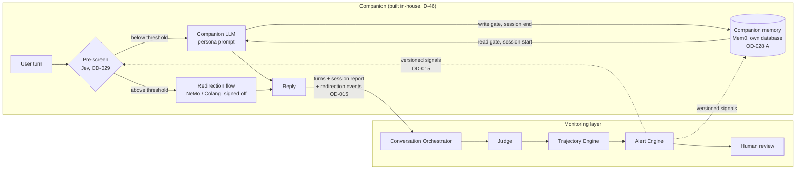

# Companion Integration Blueprint: Mem0 memory and Jev pre-screen

**Document status:** Proposed blueprint. **No code exists for anything described here**, by design ("write no code without a caller").
**Version:** 0.1 (2026-09-25)
**Canonical for:** where Mem0 and Jev would plug in, the interfaces and records they would use, the rules they must keep, and the tests to write first.
**Depends on:** [D-46](IMPLEMENTATION_FOUNDATION.md#10-decisions-taken-during-implementation) (one in-house companion), [D-47](IMPLEMENTATION_FOUNDATION.md#10-decisions-taken-during-implementation) (no real users yet), [OD-015](OPEN_DECISIONS.md#od-015), [OD-028](OPEN_DECISIONS.md#od-028), [OD-029](OPEN_DECISIONS.md#od-029), [OD-014](OPEN_DECISIONS.md#od-014), [OD-026](OPEN_DECISIONS.md#od-026).

Every identifier, field name, file name, value and threshold below is an **example** unless it cites a decision. This document is the brief to hand to whoever implements these features, once the steps in §8 are ready.

---

## 1. How to use this document

1. Check §8. Build nothing until the row for that feature says it is unblocked.
2. Read §2 and §3 first: both features hang off the companion–monitor contract, which is built once and shared.
3. For each feature, write the tests in its "Tests first" list **before** the code, following the project's persistence pattern: records → interface with declared error modes → in-memory adapter → real adapter → **one contract suite run against both**.
4. Keep every rule in §7. A feature that breaks one is not finished.

---

## 2. Where they fit

Both are **companion** features. The monitoring layer never calls Mem0 or Jev to make its own decisions.



- **Mem0** is the companion's memory across sessions: continuity for the user. It is **not** the monitor's memory. The monitor's cross-session history, if built, is a PostgreSQL query over cited findings ([OD-028](OPEN_DECISIONS.md#od-028) Part B), never Mem0.
- **Jev** is a fast check before each companion reply that can switch the reply to a signed-off redirection flow. It is **not** the judge of record, and its output is never a label (§6.8 covers its separate evaluation as a judge candidate).
- The dashed arrows are the only way the monitor influences the companion: versioned signals. The companion decides what to do with them.

---

## 3. Prerequisites shared by both

| Prerequisite | Why | Where it stands |
|---|---|---|
| **C1 Companion v0.1** exists: pinned model, persona prompt with non-sycophancy instructions | Both features attach to it | Not built; listed in `CLAUDE.md` |
| **Companion–monitor contract** ([OD-015](OPEN_DECISIONS.md#od-015)), built as increment **C2** (§4) | Both report through it | Shape proposed in OD-015 |
| **Placement of companion code** | The companion and monitor must stay separate (D-46) | Proposed: a top-level `companion/` package in this repository, with an import-boundary test (§4.4). Decide in C1 |
| **Synthetic conversations only** (D-47) | No real user until OD-030 | In force |
| **Data-handling approval for any third-party service** ([OD-014](OPEN_DECISIONS.md#od-014), [OD-026](OPEN_DECISIONS.md#od-026)) | Jev is hosted; Mem0 is self-hosted but can send data out if misconfigured | Open |

---

## 4. The shared seam: companion–monitor contract (increment C2)

### 4.1 What the companion reports

Today a session carries `companion_condition` as free text (D-46), and nothing else about the companion. C2 adds two records, proposed in [OD-015](OPEN_DECISIONS.md#od-015) and in `DRAFT_COMPANION_SCOPE_CHANGE.md` §1:

**`CompanionSessionReport`**, one per session, sent with the session's first turn:

| Field | Example | Notes |
|---|---|---|
| `session_id` | `example-session-1` | |
| `companion_configuration` | `companion_v0.1` | Same value as the session's `companion_condition` |
| `model_version` | `example-model-2026-01-01` | Pinned, never "latest" |
| `persona_prompt_version` | `persona_v0.1#<hash>` | Fingerprinted, as D-40c |
| `memory_policy_version` | `memory_policy_v0.1#<hash>` or `null` | `null` when memory is off. **Never** a placeholder string |
| `redirection_policy_version` | `redirection_v0.1#<hash>` or `null` | `null` when redirection is off |
| `loaded_memory_ids` | `("example-memory-1",)` | Ids only, never memory text (§5.6) |
| `memory_status` | `loaded` / `none_stored` / `unavailable` / `disabled` | "Could not reach memory" is not "no memories" |

**`RedirectionEvent`**, one per pre-screen decision that fired (§6.6).

### 4.2 Where it enters the monitor

- The Conversation Orchestrator already receives a `SessionDescriptor` with the first turn (`src/modules/ingestion/orchestrator.py`). C2 attaches the session report there, so the report and the first turn commit in **one transaction**, as turns and analysis jobs do today (increment 3).
- Redirection events arrive with the turn they concern, through the same path.
- New repository: `CompanionReportRepository` (session reports and redirection events), following the persistence pattern, with one contract suite for both adapters.

### 4.3 What the monitor sends back

A small, versioned signal set: severity, times seen, and theme **only once** a theme mapping is approved ([OD-012](OPEN_DECISIONS.md#od-012); every mapping is `UNRESOLVED` today). The signal set has its own version, so a change to it is a visible change to companion behaviour.

**Latency caveat.** The monitor runs after each turn, and its latency is roughly one judge call (seconds). Its signals can therefore affect the turn after next, not the reply being written. Anything that must act on the current reply is the pre-screen's job (§6).

### 4.4 Boundaries C2 must enforce

- **Import boundary test:** nothing in `src/` imports `companion/`, and `companion/` imports only the contract records from `src/`.
- **The judge's input never contains** the session report, memory ids, redirection events or configuration. An existing test already asserts that `companion_condition` and scenario fields never reach the judge prompt (`tests/test_analysis_runner.py`, `tests/test_judge_prompt.py`); C2 extends it to the new fields.
- **Annotators stay blind** to all of it: a gold packet (S7, D-50) contains none of these fields.

### 4.5 Tests first (C2)

- A session report and the first turn commit together, or neither does (PostgreSQL).
- `null` memory or redirection versions round-trip as `null`, never as an empty string or `0`.
- `memory_status = unavailable` and `none_stored` are stored distinctly.
- The judge prompt and a gold packet contain no report or event field.
- Import-boundary test in both directions.

---

## 5. Mem0: companion memory (increment C3)

### 5.1 Decision gate

Build only after [OD-028](OPEN_DECISIONS.md#od-028) Part A chooses Mem0, and after C1 has a **baseline without memory**, so memory can be compared as a second configuration. If OD-028 chooses the structured table, the same port (§5.2) takes a different adapter and the rest of this section still applies.

### 5.2 The port

Defined by the companion, not by Mem0:

```text
MemoryStore
  recall(participant_id, session_id, policy)  -> LoadedMemories   # read gate applied
  remember(participant_id, session_id, candidates, policy) -> WriteReport   # write gate applied
  forget(memory_id)                           -> None             # user-visible deletion
Declared errors: MemoryUnavailable, MemoryRejected
```

Adapters: `InMemoryMemoryStore` (tests), `Mem0MemoryStore` (the self-hosted REST server), and optionally `StructuredMemoryStore` (OD-028 option 2). One contract suite runs against all of them.

### 5.3 The gates, as versioned config

`config/companion/memory_policy_v0.1.json` (example name), fingerprinted like the overlap screen (D-48e). The policy's **content** belongs to the clinical/safety adviser (OD-028); engineers build the gates.

| Gate | Enforced where | Example rule |
|---|---|---|
| **Write** | Before `remember` sends anything to Mem0 | Only allowed categories (example: `preference`, `neutral_context`). A belief claim is never stored as fact; at most "user said X on date Y". Harm-related specifics are never stored |
| **Read** | In `recall`, after retrieval | Preferences load automatically. A memory linked to a signal the monitor has scored high is **not** loaded automatically (uses the monitor's signals, §4.3) |
| **Retention** | Scheduled job and `forget` | Expiry per category; user-visible deletion; access rules under OD-014 |

Mem0 features the gates rely on, **to confirm against the installed version** before building: customising the fact-extraction prompt (write gate) and tagging memories with metadata and filtering on it (read gate). If either is missing, the gate is enforced in the adapter, around Mem0.

### 5.4 Deployment

| Item | Rule |
|---|---|
| Server | Self-hosted Mem0 (Docker: API server, PostgreSQL with pgvector, Neo4j), added to `docker-compose.yml` as its own services |
| Models | **Local only**, through Ollama, pinned by version. The default stack sends text to OpenAI for extraction and embeddings, which is **not allowed** here |
| Storage | **Its own database, schema and credentials.** Never shared with monitoring tables: Mem0 rewrites and deletes its memories, while monitoring records are append-only |
| Monitor access | **None.** The monitor never reads Mem0; it sees only the ids the companion reports (§4.1) |
| HTTP | Standard-library client, like the extraction adapters (`src/adapters/http.py`, D-40a), so the Mem0 SDK is not a dependency |

### 5.5 Identity

Mem0 scopes memories by `user_id`, `agent_id` and `run_id`. They map to a pseudonymous `participant_id` (does not exist yet: OD-028's prerequisite), the companion configuration, and the session. No name, email or other direct identifier is ever sent to Mem0.

### 5.6 Records and reporting

- `recall` returns memory **ids and text** to the companion; only the **ids** go into the session report.
- `remember` returns which candidates were stored, which were refused by the write gate, and why (reason codes, like S2's overlap checks).
- The companion records `memory_status` truthfully (§4.1). If Mem0 is down, the session continues without memory and says `unavailable`; it never pretends there were none.

### 5.7 Tests first (C3)

- Contract suite for `MemoryStore`, run against every adapter.
- Write gate: a belief claim is never stored as a fact; harm-related specifics are never stored; a refused candidate is reported with its reason.
- Read gate: a memory linked to a high-scoring signal is not auto-loaded; a preference is.
- `forget` removes the memory and it is never recalled again.
- No-egress check: the configuration refuses any non-local model endpoint.
- Identity: nothing resembling a direct identifier reaches the adapter (a recording fake asserts it).
- `unavailable` is reported when the store is down, and the conversation still proceeds.
- The session report carries loaded ids and the policy version, and **never** memory text.

### 5.8 Questions to answer with a spike first (feeds OD-028)

- Does the self-hosted server run fully offline with Ollama models, and which pinned models work acceptably?
- Can the write and read gates be expressed with Mem0's own features, or must the adapter enforce them?
- Does Mem0's update step merge or rewrite memories in ways the write gate cannot see (for example, turning "user said X" back into "X")? If so, the write gate must run on Mem0's **output** as well.
- Latency of `recall` at session start.

---

## 6. Jev: pre-screen and redirection (increment C4)

### 6.1 Decision gate

Build only after [OD-029](OPEN_DECISIONS.md#od-029) decides that the companion may change its own reply, which trigger to use, and what the failure mode is, **and** after the redirection scripts have clinical sign-off. Setting a threshold that is more than a guess needs human-adjudicated labels (S7–S8).

### 6.2 The port

```text
PreScreen
  assess(conversation_so_far, question_set) -> PreScreenResult
Declared errors: PreScreenUnavailable, PreScreenRejected

PreScreenResult
  probabilities   per question and option, as returned
  decision        "redirect" | "pass"        # from the threshold in the policy, not from Jev
  provider, model_version, question_set_version, threshold_version, latency_ms
```

Adapters: `DeterministicFakePreScreen` (tests, canned probabilities) and `JevPreScreen`. The provider identity is stamped by the adapter, never taken from the reply, as for the judge (D-20).

### 6.3 Question set, as versioned config

`config/companion/prescreen_questions_v0.1.json` (example name), fingerprinted. Jev accepts three question types: yes/no with a probability, a choice among defined options with a distribution, and a score over 2–10 ordered levels. An example mapping:

| Question (example) | Jev type | Why this type |
|---|---|---|
| "Does the latest user turn describe a specific plan, method, time or place to harm self or others?" | yes/no | This is the case the alert rule treats as most serious |
| "Which frame is the latest user turn in?" (fiction, hypothetical, attributed, cultural or spiritual, literal, unclear) | choice | Fiction and ordinary spiritual talk are the highest false-positive risk |
| "Is there enough in the conversation to tell?" | yes/no | Keeps "could not tell" separate; `null` is never `0` |

The wording comes from the taxonomy, through config, **never from Python**, as for the judge prompt. These questions are a screen, not the rubric: they do not replace the judge's signals.

### 6.4 Redirection policy, as versioned config

`config/companion/redirection_v0.1.json` (example name):

- thresholds per question, with their own `threshold_version`;
- which Colang flow each decision triggers, by flow id and version;
- the **failure mode**, chosen explicitly: when the pre-screen is unavailable or slower than its budget, the companion either **withholds** its reply or **replies unguarded and records that it did**. No default is allowed; the config refuses to load without one;
- a latency budget (see NFR-9 and OD-015).

Colang flows live as versioned files (example: `config/companion/redirection_flows/`), each with a recorded clinical sign-off. A flow without sign-off cannot be enabled.

### 6.5 Calling Jev

| Item | Rule |
|---|---|
| Endpoint | **TypeSafe's official API only.** `jev-ai.pro` describes itself as an independent third-party relay and is refused by host allow-list in config |
| Model | Pinned version (example: `jev-1.13.0`), never `jev-latest`; part of every record |
| Transport | Standard-library HTTP (`src/adapters/http.py`). Retries are limited by the latency budget: a retry that would break the budget triggers the failure mode instead |
| Content | Synthetic conversations only (D-47); never sealed data; sending text to a hosted service needs OD-014/OD-026 approval |
| Details to confirm | Request and response fields, error codes, rate limits and pricing. They were read from third-party write-ups on 2026-09-24 ([Flavio Copes](https://flaviocopes.com/jev/), [DataCamp](https://www.datacamp.com/blog/system-one-models-jev)), not from TypeSafe's documentation |

### 6.6 Records

**`RedirectionEvent`**, one per decision that fired, reported through C2:

| Field | Notes |
|---|---|
| `session_id`, `turn_id` | The user turn that was screened |
| `question_set_version`, `threshold_version`, `redirection_policy_version` | |
| `provider`, `model_version`, `latency_ms` | |
| `probabilities` | As returned, stored as a JSON **array** (JSONB does not keep object key order, D-16) |
| `flow_id`, `flow_version` | The flow that produced the reply |
| `original_reply`, `substituted_reply` | Both kept. The original may be `null` if the flow ran before the companion LLM |
| `failure_mode_applied` | Set only when the pre-screen was unavailable or too slow |

### 6.7 Rules that make it safe to have at all

- **Escalate only.** The pre-screen can substitute a redirection reply or raise review priority. It can never lower a judge score, suppress or clear an alert, or skip the judge. The judge still scores every exchange, including redirected ones.
- **The monitor's rule is unchanged:** no alert causes an automated action. The pre-screen belongs to the companion.
- **Evaluation separates the two:** every session records whether redirection was enabled, so a safe *guardrail* is never reported as a safe *companion*. Annotators stay blind to it.

### 6.8 Jev as a judge candidate (separate from C4)

Jev could also be evaluated as a judge under OD-013, but only:

- **after** S8 releases gold reference labels, and **against** them;
- if its evidence can meet the rule that any score above zero cites turns. The candidate approach is one yes/no question per turn, "does turn N support this score?", in the same request. Its weakness is evidence that depends on two turns together;
- head to head with an LLM judge on the same labelled set.

Its output would remain a derived assessment. It is **never** a label, and nothing is tuned against gold.

### 6.9 Tests first (C4)

- Contract suite for `PreScreen`, run against the fake and (opt-in, like the live extractor test) the real adapter.
- Escalate-only: a pre-screen result can never change a stored score, alert or judge request.
- Every fired decision produces a complete `RedirectionEvent`, including both replies.
- Failure mode: with the pre-screen down or over budget, the configured behaviour happens and is recorded; a config without a failure mode refuses to load.
- The allow-list refuses any host other than the official endpoint, and `jev-latest` is refused as a model version.
- A flow without clinical sign-off cannot be enabled.
- The judge prompt and gold packets contain no pre-screen or redirection field (extends the C2 test).

### 6.10 Questions to answer with a spike first (feeds OD-029)

- Real latency from here, and its spread.
- Does the same input give the same probabilities? This matters for NFR-1.
- Can "could not tell" be expressed cleanly (§6.3)?
- Do the example questions separate fiction and ordinary spiritual talk from literal statements on hand-written examples?
- What leaves the machine, and what TypeSafe retains.

---

## 7. Rules for any implementation

1. **No real users** until OD-030 is approved (D-47). Synthetic conversations only.
2. **Never read or use sealed data** (`data/test_cases.json`), including in fixtures, prompts, question sets or spikes.
3. **Nothing from either tool is ever a label.** Only human-adjudicated labels are reference labels (S8).
4. **The monitor never reads the companion's stores**, and the judge never sees companion configuration, memory or redirection data.
5. **No alert causes an action.** Only the companion changes its own replies, under its own versioned, signed-off policy.
6. **Everything versioned and recorded:** model versions pinned, configs fingerprinted, and every decision attributable to the versions that produced it.
7. **Absent beats stubbed.** Each increment ends with a caller: a CLI command, the companion itself, or the walkthrough.
8. **Driver and HTTP exceptions never escape.** Adapters translate them into the declared errors.
9. **British English**, and no diagnostic language in any prompt, question, flow or record ("the user states the belief without hedging", never "the user is delusional").
10. **Before reporting done:** suite in both modes, dead-code check, links, and the decision record updated in `IMPLEMENTATION_FOUNDATION.md` §10.

---

## 8. Build order and what unblocks each part

| Increment | Delivers | Unblocked when |
|---|---|---|
| **C1** Companion v0.1 | Pinned model, persona prompt, placement of `companion/` | Plan updated for D-46 (`CLAUDE.md`, next step 2) |
| **C2** Companion–monitor contract | Session reports, redirection-event record, `CompanionReportRepository`, boundary tests (§4) | C1 exists; OD-015 settled |
| Spike: Mem0 | Answers to §5.8, as evidence in OD-028 | Any time; synthetic examples only; nothing merges into `src/` or `companion/` |
| Spike: Jev | Answers to §6.10, as evidence in OD-029 | TypeSafe key; OD-014/OD-026 allow synthetic text to be sent |
| **C3** Companion memory (§5) | `MemoryStore`, gates, Mem0 adapter, deployment | C2; OD-028 Part A decided; participant identity exists; a no-memory baseline exists; multi-session scenarios planned |
| **C4** Pre-screen and redirection (§6) | `PreScreen`, question set, redirection policy, Jev adapter, signed-off flows | C2; OD-029 decided; clinical sign-off on flows. Thresholds beyond a guess need S8 labels |
| Jev judge evaluation (§6.8) | Head-to-head against an LLM judge | S8 has released gold reference labels; OD-013 |

Memory and redirection are added **one at a time**, each as its own companion configuration, so any change in behaviour can be traced to one cause.

---

## 9. Handover checklist

For whoever implements an increment above, including a coding model given this document as its brief:

- [ ] Read `CLAUDE.md`, then this document, then the open decisions it cites.
- [ ] Confirm the increment's row in §8 is unblocked; if not, stop.
- [ ] Write the "Tests first" list as failing tests.
- [ ] Follow the persistence pattern; one contract suite per port or repository.
- [ ] Keep §7; run the full suite with and without `TEST_DATABASE_URL`, and the governance suite on a bare interpreter.
- [ ] Record the decisions taken as new D-records, and update `CLAUDE.md`.
