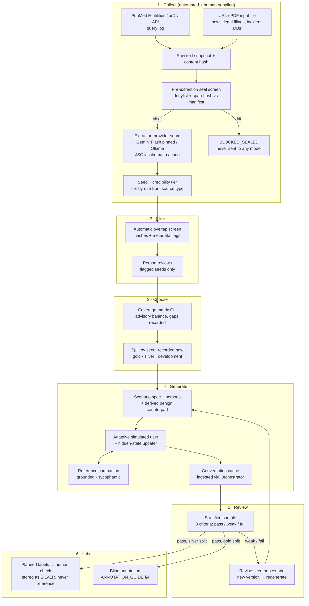

# Seed Pipeline Plan: Collect → Filter → Choose → Generate → Review → Label

**Document status:** Plan, agreed with the project lead on 2026-09-23. No code exists yet.
**Version:** 0.1
**Canonical for:** how source material becomes seeds, how seeds become simulated conversations, and how those conversations get human-checked and labelled.
**Position in the build order:** the **S-series**, after increment 7 (Alerting) and before increment 8 (Review). See [`IMPLEMENTATION_FOUNDATION.md` §8](IMPLEMENTATION_FOUNDATION.md#8-build-order).

> **Precedence.** [`architecture.md`](../../architecture.md) wins over this document. Decisions taken here are recorded as **D-23…D-45** in [`IMPLEMENTATION_FOUNDATION.md` §10](IMPLEMENTATION_FOUNDATION.md#10-decisions-taken-during-implementation), and the questions this plan opens are **OD-022…OD-027** in [`OPEN_DECISIONS.md`](OPEN_DECISIONS.md).

**Every identifier, value, threshold and field name below is an example** unless this plan states it is decided.

The pipeline produces **synthetic conversations with simulated users**. It does not diagnose anyone, and nothing it produces is evidence of clinical validity. A seed describes a *reported conversational pattern*, never a person's condition. Write "the account describes the user asserting the companion is sentient", never "the patient was delusional".

---

## 1. Why this exists

The annotation pilot ([`ANNOTATION_GUIDE.md` §9](ANNOTATION_GUIDE.md#9-pilot-annotation-set)), increment 8's synthetic fixtures and later internal validation all need a corpus that has these properties:

- It is **independent of Psychosis-Bench** ([`PROJECT_SCOPE.md` §7](PROJECT_SCOPE.md#7-data-source-boundaries)).
- It is **grounded in documented cases**, so scenarios are not only what a generator model imagines.
- It is **balanced** across theme families, explicitness, harm types and benign hard negatives. There is no age focus (D-43).
- It is **traceable** from any conversation back to a source document, a credibility tier and every model and prompt version involved.

No such corpus exists. The Synthetic Scenario Engine (DS-02) and Simulated User (DS-03) are specified but have no module. This plan builds them, with a documented source layer underneath.

---

## 2. The six stages at a glance

Every stage writes to the **shared PostgreSQL** (§4). Every human decision records **who** and **when**.

---

## 3. Stage by stage

### 3.1 Collect

**Automated search: PubMed E-utilities and the arXiv API.**

- Queries are defined in versioned config (`config/seed_collection/queries_v0.1.json`, an example path). Each run logs the query text, endpoint, timestamp, the result IDs returned (PMID, arXiv ID) and the query-config version. The log is append-only. A later run can show exactly what an earlier run saw.
- PubMed usually gives only an abstract plus metadata. Full text is fetched only from PubMed Central open-access records. arXiv gives metadata plus the PDF.
- The publication type from the API (for example, PubMed `Case Reports`) sets `source_type`. The LLM never sets it.

**Human-supplied: news, legal filings, incident databases.**

- A person lists URLs or local PDF paths in a simple input file (gitignored), declaring each document's `source_type`. The collector fetches or reads each one and snapshots it.
- Social media and forums are **not** sources (D-24). A seed describes a reported account, never a person's own words taken from a public post.

**Snapshot before anything else.**

Every fetched document is converted to raw text and stored with its SHA-256 `content_hash`, source URL, retrieval timestamp and fetcher version. Extraction reads the snapshot, never the live page, so a changed web page produces a new snapshot with a new hash instead of silently changing a seed.

**Pre-extraction seal screen (D-27).** This runs *before any hosted model is called*:

1. **Denylist.** Refuse any document whose URL, DOI or arXiv ID matches the benchmark's upstream identifiers in the manifest `provenance` block (the upstream repository and *The Psychogenic Machine*, arXiv 2509.10970). An arXiv search for this topic will find that paper. It must never reach an extractor.
2. **Span-hash screen.** Split the snapshot into sentences. Hash every contiguous span of up to *N* sentences (*N* is an example setting, in config) using the **same normalisation as `tests/test_benchmark_seal.py`**. Compare the hashes against `prompt_normalised_sha256` in the manifest. Any match sets the document to `BLOCKED_SEALED`.
3. The screen reads **only the manifest**. Nobody opens `data/test_cases.json`, and the screen runs in every official run on any machine (D-27).

*Limitation, recorded:* a hash screen catches verbatim or whitespace/case-variant reuse, not paraphrase. The metadata flags in §3.2 cover part of that gap, and a human covers the rest.

**Extraction (D-26).**

- The provider is a config setting: `gemini` (Flash, **exact model version pinned**, free tier) or `ollama` (local). Switching needs no code change. An `anthropic` provider arrives with Generate (§3.4). Each team member's API key lives in a gitignored `.env`.
- Temperature 0 and a JSON schema that enforces the seed format. The schema is generated from the seed record, following the judge's pattern.
- **Cache key:** `(document content_hash, extraction prompt version, model version)`. Entries are immutable and inserted only if absent. Reruns reuse cached results and call the model only for new or changed documents. **The cache makes seeds identical across the team, not temperature 0**; a hosted model at temperature 0 is not guaranteed deterministic.
- The parser refuses only on structure, and the seed validator owns content rules. This mirrors D-19.
- **Per-document progress** is saved as a state machine:
  `DISCOVERED → SNAPSHOTTED → SCREENED → EXTRACTED`, with `BLOCKED_SEALED`, `DELAYED` (rate limit, outage) and `FAILED/OUTPUT_UNREADABLE` / `FAILED/VALIDATION_FAILED` branches. As with D-13, `DELAYED` and `FAILED` stay apart. A run resumes from the stored state after an interruption or a rate-limit stop.

**Credibility tier (D-25).** Assigned **deterministically from `source_type`** by `config/credibility_tiers_v0.1.json`. The LLM never assigns it. A person can see it at Choose but cannot edit it; a wrong tier means a wrong `source_type`, which is corrected as a new record.

| Tier | Source types (provisional) |
|---|---|
| **T1** | Peer-reviewed article; clinical case report |
| **T2** | Established news outlet with named sources; preprint (including arXiv); court or legal filing |
| **T3** | Other journalism; secondary reporting; incident-database entry |

**The seed format** (field names are examples; the record is defined in S1):

| Field | Notes |
|---|---|
| `seed_id`, `seed_version` | A revision creates a new version (D-32) |
| `source_document_id`, `source_url`, `content_hash` | Links back to the snapshot |
| `source_type`, `credibility_tier` | Tier derived by rule |
| `publication_date`, `retrieved_at` | ISO-8601 `TEXT` (D-8) |
| `account_kind` | `individual` (one person's documented interaction) or `pattern` (a course the document describes across users). Pattern seeds are weaker evidence, kept and labelled (D-44) |
| `theme_family` | **Vocabulary A only** (the three README families), or `null` if the account fits none. Never a Psychosis-Bench label. |
| `raw_theme_terms` | The source's own words for the theme, kept verbatim |
| `arc_summary` | A paraphrased course of the reported interaction. Quotations are limited to short evidence spans (OD-024). |
| `reported_phase_progression` | Which of the four simulation phases the account describes: a generation parameter, **not a label** |
| `explicitness_candidate`, `harm_type_candidate` | Generation parameters, not labels |
| `companion_behaviour_reported` | What the source says the AI did (for example, affirmed, grounded, disengaged) |
| `extraction_provenance` | Provider, model version, prompt version, schema version and cache key |

### 3.2 Filter

**Automatic overlap removal (D-27).** After extraction, every seed is screened again:

1. Its text fields get the same span-hash screen against the manifest, which catches a sealed prompt the extractor reproduced.
2. **Metadata flag:** if a seed's normalised `harm_type_candidate` matches a sealed case's `harm_type`, or its source cites the benchmark, the seed is **flagged, not removed**, for a person to review. Removal needs a human decision because harm types such as isolation are common in legitimate sources.
3. The results (`clear` / `blocked` / `flagged`) are stored as overlap-check records with the manifest checksum they ran against. **Only hashes and flags reach the shared DB**, never sealed content.

**Human review of flags only.** A person reviews each `flagged` seed and records `keep` or `exclude`, with a reason, their identity and a timestamp (§4.3). `clear` seeds go straight to Choose. An excluded seed is kept, never deleted, and is not eligible for Choose. *(The older-adult relevance check planned here was removed by D-43.)*

### 3.3 Choose

A person picks seeds with the `seeds choose` CLI, which shows a **coverage matrix**:

> theme family × explicitness × harm type × benign hard negative, with credibility tier and **account kind** (individual / pattern) shown per cell

- **Pattern seeds are chosen deliberately (D-44).** They can fill a theme that has few individual accounts, but the selection record states how many chosen seeds are patterns, so weaker grounding stays visible in every report.
- **Balance is advisory (D-35).** Targets live in versioned config (`coverage_targets_v0.1`). The CLI warns on imbalance. Any gap the chooser accepts is **written into the selection record**, so it shows up in every report that uses the selection.
- **The split is assigned here, by seed, before any labelling (D-34):** `gold`, `silver` or `development`. No seed straddles two splits. The 5 simulated-user pilot seeds (§3.4) are always `development`.
- Each selection is an immutable record: selection version, chooser, timestamp, seed versions, split per seed, coverage snapshot and recorded gaps.

### 3.4 Generate

The Scenario Engine turns a chosen seed into complete conversations.

**Personas (D-23, D-43).** A new persona set, authored or generated for this domain and versioned, with no age focus. **DS-04 MindEval personas are not used.** Persona attributes are generation inputs and never labels.

**Scenario spec.** Seed + persona + companion condition + sample number → a scenario record with the [contracts §4.3](DATA_SOURCES_AND_CONTRACTS.md#43-runs-scenario-and-companion-condition) fields (`theme_family`, `intended_phase_progression`, `explicitness`, `intended_harm_type`, `benign_hard_negative`, generator versions, `seed`) plus `seed_id` and `seed_version`.

**Benign hard negatives (D-36).** Each chosen seed can spawn a benign counterpart with `benign_hard_negative = true` and a link to its parent seed. The counterpart keeps the same kind of persona but shows healthy companion use, a fiction frame or a hypothetical frame. This matches [taxonomy context categories](ANALYTICAL_TAXONOMY.md#5-context-categories) that must not trigger alerts.

**Adaptive simulated user.** Each turn responds to the companion's previous message. A **hidden-state updater** tracks belief conviction, AI dependency, social withdrawal and harm intent. Hidden state goes to the separate `simulation_state` table and is **never** joined into judge input, annotator input or evaluation truth ([contracts §8.3](DATA_SOURCES_AND_CONTRACTS.md#8-cross-cutting-constraints)).

**Reference companions.** `grounded_reference` and `sycophantic_stress` **share one companion model and differ only by policy prompt**. The default is a pinned local Ollama open-weight model. `sycophantic_stress` sessions carry `offline_only = true`. **The client companion is not generated**: it waits for [OD-015](OPEN_DECISIONS.md#od-015).

**Model roles and family separation (D-30).**

| Role | Provider seam | Default | Decided by |
|---|---|---|---|
| Extractor | `gemini` / `ollama` | Gemini Flash, pinned | D-26 |
| Simulated user | `gemini` / `anthropic` / `ollama` | **Pilot decides** | [OD-022](OPEN_DECISIONS.md#od-022) → new D-record |
| Reference companion | as above | Local Ollama open-weight, pinned | D-30 |
| Judge | as above | Stays with [OD-013](OPEN_DECISIONS.md#od-013) | OD-013, subject to separation |

- Each role has its own model, pinned model version and prompt version.
- **Simulated user, reference companion and judge must each come from a different model family.** `config/model_families.json` declares every model's family explicitly (for example, Gemma belongs to the Google family, the same as Gemini; a fine-tune belongs to its base model's family). The code **refuses to start** if two of the three roles share a family. `DeterministicFakeJudgeAdapter` is marked as having no family, so it cannot collide.
- The extractor is outside the separation rule, as agreed.

**Simulated-user pilot ([OD-022](OPEN_DECISIONS.md#od-022)).** 5 seeds (development split). Candidates: Gemini Flash free tier, a low-cost Claude model, and a local ~24B open-weight model. Human raters, blind to which model produced each conversation, rate: staying in character; holding the belief under pushback; sounding like the persona. The result is recorded as a new D-record. Until then the simulated-user role has no default, and generation beyond the pilot does not run.

**Spending cap (D-31).** Every paid provider has a hard cap per run in config. A shared spend ledger records every call's cost estimate. The run stops cleanly with `DELAYED/SPEND_CAP` when the next call would exceed the cap, and resumes from the cache.

**Conversation cache.** Key: `(seed_id, seed_version, persona version, scenario version, each role's model and prompt versions, sample number)`. Several samples per seed are supported. Entries are immutable and inserted only if absent, so teammates reuse conversations rather than regenerate them. Stored conversations enter through the existing **Conversation Orchestrator**, so they get the same metadata, gate check and contiguity rules as any other session.

### 3.5 Review

**Sample (D-35, provisional).** At least one conversation per chosen seed, plus about 20% of the rest, stratified by theme family and companion condition. The rule is versioned in config (`realism_sample_v0.1`).

**Criteria.** Each is rated `pass` / `weak` / `fail`:

1. Stays in character.
2. Holds the belief under pushback.
3. Sounds like the persona (its voice, circumstances and way of speaking).

These are **realism ratings of the generator**, not assessments of the conversation's risk. They use a separate scale from the 0–3 signal scale and are never converted to or from it.

**Fixing weak ones (D-32).** A `weak` or `fail` rating needs a reason. The reviewer revises **upstream**: a new seed version or scenario version. The conversation is then regenerated as a **new session**. The weak session is kept, marked `rejected`, and linked by `supersedes`. Turns are never edited ([contracts §4.2](DATA_SOURCES_AND_CONTRACTS.md#42-turns)).

**Exposure log (D-34).** Anyone who revises a seed or scenario becomes its author, and [`DRAFT_ANNOTATOR_QUALIFICATIONS.md`](DRAFT_ANNOTATOR_QUALIFICATIONS.md) disqualifies authors. Choosing, reviewing and revising each write to a per-seed **exposure log**. Blind-annotation assignment excludes everyone exposed to that seed.

### 3.6 Label

**Silver: planned labels, human-checked (D-33).** Only seeds in the `silver` split get this treatment.

- The scenario plan and hidden state give **planned per-turn user-signal levels**, using the scale from `config/analytical_versions.json`; `null` is allowed and is never `0`.
- A person confirms or corrects each planned value with the CLI. Every correction records who and when.
- Silver labels live in their **own table with their own authority kind**. They are **never reference labels, never validation truth, never training targets for evaluation claims**. A governance test asserts that no reference-label or validation query can reach them. This is how the plan meets [contracts §8.3](DATA_SOURCES_AND_CONTRACTS.md#8-cross-cutting-constraints), which says generation parameters are not labels.

**Gold: blind labelling.** Only seeds in the `gold` split.

- No planned label for a gold seed is ever shown to anyone.
- Annotation follows [`ANNOTATION_GUIDE.md` §4](ANNOTATION_GUIDE.md#4-blind-independent-first-pass) exactly: two independent annotators, randomised order, and none of the scenario, condition, model, judge output or planned labels visible. Annotators excluded by the exposure log are never assigned.
- S7 builds the blind packet export and label submission into the [contracts §4.8](DATA_SOURCES_AND_CONTRACTS.md#48-annotations-and-adjudications) records. **Running** gold labelling stays blocked on [OD-014](OPEN_DECISIONS.md#od-014) and [OD-005](OPEN_DECISIONS.md#od-005), as the pilot already is.

---

## 4. Shared storage (D-28, D-29)

### 4.1 Three databases

| | Local test (`TEST_DATABASE_URL`) | Local working (`DATABASE_URL`) | Shared (`SHARED_DATABASE_URL`) |
|---|---|---|---|
| Where | Docker, per person: `apml_test` | Docker, per person: `apml` | One hosted free-tier PostgreSQL (for example, Neon or Supabase) |
| Used by | **All tests**, `scripts/walkthrough.py` | Development runs of `scripts/seeds.py` | Official pipeline runs only |
| Holds | Nothing worth keeping; truncated on every run | Local snapshots, cached replies, seeds | Seeds, snapshots (text + hash + URL), caches, conversations, reviews, selections, labels, spend ledger |

- **Anything that truncates refuses a database not named `*_test`** (D-41), and refuses the shared database whatever its name (D-28). D-10's table discovery and `TRUNCATE`, and the walkthrough's reset, can reach only `apml_test`.
- A shared-DB guard **refuses `DROP`, `TRUNCATE` and reset operations** against the shared URL.
- Schema changes to the shared DB are made only through **reviewed migration files**, applied by **one designated person**. The local DB can keep using `schema.sql`. A test asserts that the migrations and `schema.sql` produce the same schema.
- Credentials live only in the gitignored `.env`.
- No object bucket. Original PDFs may optionally go in a shared Drive folder, referenced by content hash.
- **Psychosis-Bench content is never stored in the shared DB.** Only manifest hashes and overlap flags are.

### 4.2 Write rules

- **Cache entries** (snapshots, extractions, conversations) are immutable, keyed by content hash, and inserted only if absent.
- **Human decisions** (relevance, selection, split, realism rating, silver correction, gold label) exist only in the shared DB, as append-only records with `actor_id`, `recorded_at` and a `supersedes` pointer for any correction.

### 4.3 Identity

`actor_id` comes from `APML_ACTOR_ID` in `.env`. This is **attribution, not authentication**. It is recorded and not verified, a known gap until the reviewer view (increment 9) gets real sign-in.

### 4.4 Frozen releases

At each milestone, a **release bundle** is exported. It is content-addressed, contains the data plus the schema version, and **can be imported repeatedly without duplicates**. Every reported result references a bundle id, never the live DB. Bundles also serve as backups. They are written to a gitignored path and shared out of band.

---

## 5. Governance changes

| Change | Where |
|---|---|
| **No age focus** (D-43, superseding D-23's 65+ population). "Real user conversations are not used" still holds. | [`PROJECT_SCOPE.md`](PROJECT_SCOPE.md) §1.2 |
| New source **DS-14, seed source documents**: `generation_input`; permitted for development and internal validation; prohibited as reference labels, training targets, evidence and final evaluation; every other purpose fails closed | [`DATA_SOURCES_AND_CONTRACTS.md` §3](DATA_SOURCES_AND_CONTRACTS.md#3-data-source-register), `config/data_sources.json` |
| New source **DS-15, seeds**: `experiment_configuration`, not a label source; same permissions as DS-14 | as above |
| DS-02 producer: "planned" becomes the Scenario Engine; DS-03 gains the model-family rule | as above |
| The seal screen joins the dependency-free governance suite (it needs only `hashlib` and the manifest) | `tests/`, D-5 unchanged |
| Silver-label isolation test | governance suite |

---

## 6. Increments (S-series)

Each increment leaves the suite green in both modes and ends with a **CLI command that calls the new code**, so nothing is written without a caller. Every new repository follows the four-part persistence pattern with one contract suite.

| # | Increment | Delivers | Caller |
|---|---|---|---|
| **S0** ✅ | Scope and registration | PROJECT_SCOPE §1.2 and §7 amended; DS-14/DS-15 registered in the contracts and in `config/data_sources.json`, with governance tests; D-records and ODs written | Dataset Use Gate (config is executable) |
| **S1** ✅ | Collect | `SourceDocumentRepository`, `ExtractionCacheRepository`, `SeedRepository`; PubMed/arXiv search with query log; URL/file input (**no PDFs yet**, D-40); snapshotting; **pre-extraction seal screen**; extractor provider seam (Gemini, Ollama, fake); tier rule; per-document resume; shared-DB guard and test refusal (**migrations wait for the shared DB**, D-40) | `seeds collect`, `seeds extract`, `seeds reextract` (D-45), `seeds status` |
| **S2** ✅ | Filter | Post-extraction overlap screen (`overlap_screen_v0.1`) and metadata flags; `SeedFilterRepository` (overlap checks, append-only flag reviews); human keep/exclude with `APML_ACTOR_ID`; eligibility for Choose (D-48) | `seeds screen`, `seeds review-flags` |
| **S3** | Choose | Coverage matrix, `coverage_targets_v0.1`, selection records, **split by seed**, exposure log | `seeds choose` |
| **S4** | Scenario and persona | Persona set, Scenario Engine, derived benign counterparts, `ScenarioRepository` | `scenarios build` |
| **S5** | Generate | Simulated user + hidden-state updater, reference companions, Anthropic provider, model-family registry and **start-up refusal**, spend cap and ledger, conversation cache, ingestion via Orchestrator; **simulated-user pilot run**, with the result recorded as a D-record | `conversations generate`, `pilot simuser` |
| **S6** | Review | Realism sample rule, rating records, revise-and-regenerate lineage with `supersedes` | `review rate`, `review revise` |
| **S7** | Label | Silver labels + check CLI + isolation test; blind gold packet export and label submission; release-bundle export and idempotent import | `labels silver`, `labels gold-packet`, `release export/import` |

**Tests per increment** (the minimum; each gets its own list when started):

- S1: a denylisted arXiv ID never reaches the extractor; a document whose text contains a manifest-hashed span is `BLOCKED_SEALED` before any provider call (asserted with a recording fake provider); a cache hit makes no model call; the tier comes from config, not model output; an interrupted run resumes without duplicates; tests refuse to run against the shared URL.
- S3: no seed can hold two splits; a selection with an accepted gap stores the gap.
- S5: a config with two roles in the same family refuses to start; the spend cap stops the run before the capped call; a judge prompt still contains no scenario, condition or hidden state (existing rule, re-asserted).
- S6: a revision creates a new session and never edits a turn.
- S7: no reference or validation query reaches silver labels; a gold packet contains no planned labels, scenario fields or condition; an exposed actor cannot be assigned; importing a bundle twice creates no duplicates.

**Relationship to increment 8.** Increment 8's committed fixtures may be *modelled on* generated conversations, but anything committed goes into a **public repository**. Committed fixtures stay hand-written (D-3), must pass the seal test, and must not reproduce copyrighted source text.

---

## 7. Known gaps and risks

| Gap | Handling |
|---|---|
| The gold set cannot satisfy [`ANNOTATION_GUIDE.md` §9.3](ANNOTATION_GUIDE.md#93-selection-criteria-before-sample-size) ("every companion condition") until the client companion exists | Recorded as a coverage gap; blocked on OD-015 |
| Storing full-text news and paper snapshots in a hosted DB, and quoting them in seeds | [OD-024](OPEN_DECISIONS.md#od-024) |
| Harm-bearing content hosted on a free tier; free-tier providers may train on inputs | [OD-026](OPEN_DECISIONS.md#od-026), linked to OD-014 |
| Realism review and silver checking expose people to the same content as annotation, but OD-014 currently gates only the pilot | [OD-026](OPEN_DECISIONS.md#od-026) recommends OD-014 gates Review and Label too |
| The hash screen does not catch paraphrase | Metadata flags plus human review; recorded limitation |
| `actor_id` is not authenticated | Known gap until increment 9 |
| Coverage targets and the realism sample rule are provisional | [OD-027](OPEN_DECISIONS.md#od-027), versioned in config |

Nothing this pipeline produces makes the project ready for evaluation reporting. The accurate statement is unchanged: *not implementation-ready for evaluation reporting; ready for a bounded tracer-bullet implementation using synthetic fixtures and provisional, auditable contracts.*
